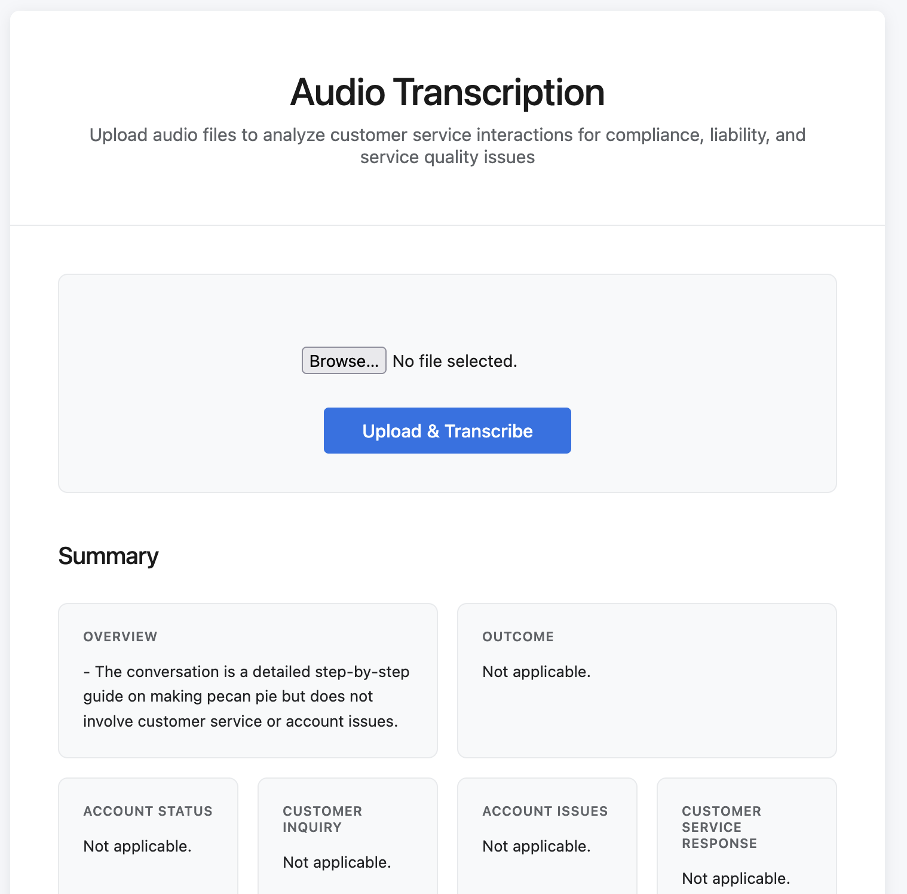

# Voice to Text Project

An audio transcription application that converts speech to text with features for analysis of customer service interactions for compliance, liability, and service quality issues

---

## Features
- Audio transcription and diarization with Whisper AI
- Key point extraction and summarization via OpenAI
- Conversation insights and analysis
- Basic UI for file upload and results

## 👨‍💻 Tech Stack
- **Python**
- **Flask**
- **Whisper AI**
- **OpenAI API (responses beta)**
- **Jinja2 (HTML templating)**

## 📋 Usage

1. Upload an audio file
2. The system will:
   - Transcribe the audio
   - Identify different speakers
   - Generate a summary with key points
3. View the results in the web interface

## 🤝 Contributing

Contributions welcome! See [CONTRIBUTING.md](/transcription_app/CONTRIBUTING.md) for development setup and guidelines

## 📝 License

## Deployed App
https://conversation-analysis.fly.dev/

## Questions
For any questions please reach out to via:
github: [celinalou92](https://github.com/celinalou92) or
email: celinalouissaint@gmail.com